# Team 7 - 'Quiz Champion'

This is single-page application for creating, sharing and participating in quizzes. It is comprehensive solutions for educators and enthusiasts to create and participate.The platform has features like public and private quizzes, scoreboards, rankings and even game element.

### 1. Contents

* [Features](#features)
* [Installation](#installation)
* [Configuration](#configuration)
* [Usage](#usage)
* [Project Structure](#project-structure)
* [Dependencies](#dependencies)

#### 1.1 Features

* **Authentication:**

  * Users can register for an account.
  * Users can log in to access their account.
  * Users can manage their profiles (e.g., update information, change settings).
* **Quizzes:**

  * Users can view available quizzes.
* **Report:**

  * Users can report quizzes, presumably for issues like inaccuracies or inappropriate content.
* **Admin Functions:**

  * Admins have the ability to manage users (e.g., view user activity, handle account issues).
  * Admins can apply bans to users who violate terms or policies.

#### 1.2 Installation

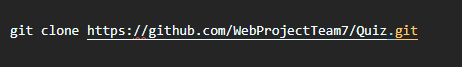

#### 1.3 Configuration

Create a Firebase project ([Firebase console - create a project ](https://console.firebase.google.com/u/1/)) and obtain your Firebase configuration details. Update the `firebase-config.js` file with your Firebase credentials.

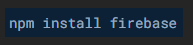

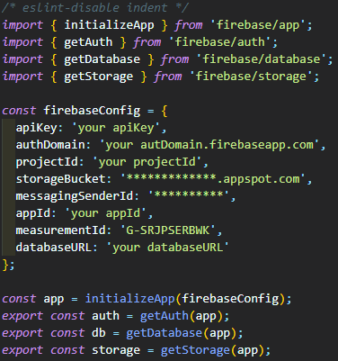

**Install the project dependencies:**

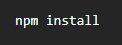

**Start the development server:**

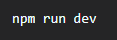

This command will usually start a local server and you should see output in your terminal indicating that the server is running. You can then open your web browser and navigate to the address provided in the output (often `http://localhost:3000` or a similar URL) to view your application.

**Realtime Databese Rules:**

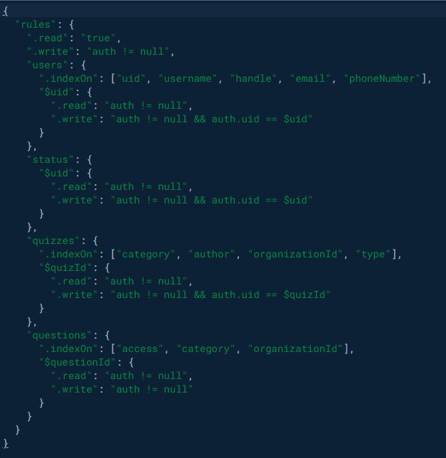

**Storage Rules:**

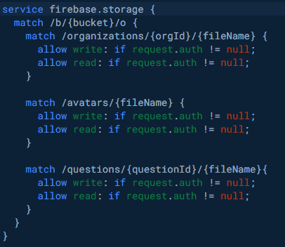

#### 1.4 Usage

* **Home Page** **:** Users can see the sample quiz and navigate to various sections.
* **Register/Login** **:** Users can register or log in to their accounts.
* **Quiz :** View categories, quiz of the week and invitational quizzes.
* **Profile** **:** Manage user profiles and settings. Have quiz history, notifications section.
* **Admin Page** **:** Admins can manage users and organizers the quiz.

#### 1.5 Project Structure

`src/` – Contains all the source code

    `components/` – Reusable UI components

    `services/` – Functions for interacting with Firebase

    `views/` – React components for different pages

    `state/` – Context for global state management

    `config/` – Firebase configuration

    `common/` – Common utilities and enums

    `CSS/` – Stylesheets

 `public/` – Static files like `index.html`

`firebase-config.js` – Firebase configuration file

#### 1.6 Dependencies

* `react`
* `react-dom`
* `react-router-dom`
* `firebase`
* `react-firebase-hooks`
* `react-icons`

### 2. Components

##### 2.1 App.jsx

**Purpose:** The root component of the application that sets up the main layout, routing, and state management.

**Key Features:**

* **Routing:** Uses `react-router-dom` to handle navigation between different pages.
* **State Management:** Provides global state management using `AppContext` to manage user state and search queries.
* **Authentication:** Integrates Firebase Authentication for user management.
* **Modals:** Controls visibility of registration and login modals.
* **Header:** Displays the main navigation header.

##### 2.2 Header

**Location:** `src/components/Header/Header.jsx`

**Purpose:** Displays the top navigation bar of the application.

**Key Features:**

* **Navigation:** Provides links to various sections of the app (e.g., Home, Profile, Admin Page).
* **Modals:** Includes buttons to open registration and login modals.
* **User Info:** Displays user-specific information if the user is logged in.

##### 2.3 Home.jsx

**Location:** `src/views/Home/Home.jsx`

**Purpose:** The landing page of the application.

**Key Features:**

* **Sample Quiz:** Displays a sample quiz for users to try.
* **Navigation:** Provides links to various quiz-related sections and features of the app.

##### 2.4 NotFound

**Location:** `src/views/NotFound/NotFound.jsx`

**Purpose:** Displays a 404 error page when a user navigates to a non-existent route.

**Key Features:**

* **Error Message:** Shows a friendly message indicating that the page was not found.
* **Navigation:** Provides a link back to the home page.

##### 2.5 RegistrationModal

**Location:** `src/components/RegistrationModal/RegistrationModal.jsx`

**Purpose:** Displays a modal for user registration.

**Key Features:**

* **Form:** Contains fields for user registration (e.g., email, password).
* **Visibility Control:** Controlled by `useModal` hook to open or close the modal.
* **Submit Handler:** Handles user registration process and form validation.

##### 2.6 MyProfile

**Location:** `src/views/MyProfile/MyProfile.jsx`

**Purpose:** Displays and manages the user’s profile.

**Key Features:**

* **Profile Information:** Shows user details such as name, email, and profile picture.
* **Quiz History:** Displays the user’s past quiz attempts and results.
* **Settings:** Allows users to update their profile settings.

##### 2.7 LoginModal

**Location:** `src/components/LoginModal/LoginModal.jsx`

**Purpose:** Displays a modal for user login.

**Key Features:**

* **Form:** Contains fields for user login (e.g., email, password).
* **Visibility Control:** Controlled by `useModal` hook to open or close the modal.
* **Submit Handler:** Handles user login process and form validation.
* **Registration Link:** Provides an option to open the registration modal.

##### 2.8 QuizOfTheWeek

**Location:** `src/views/QuizOfTheWeek/QuizOfTheWeek.jsx`

**Purpose:** Displays the quiz of the week.

**Key Features:**

* **Quiz Details:** Shows information about the current quiz of the week.
* **Participation:** Provides options to participate in the quiz.

##### 2.9 QuizOfTheWeekDetail

**Location:** `src/views/QuizOfTheWeekDetail/QuizOfTheWeekDetail.jsx`

**Purpose:** Shows detailed information about the quiz of the week.

**Key Features:**

* **Detailed View:** Displays detailed questions and answers for the quiz of the week.
* **Participation:** Option to start the quiz.

##### 2.10 Quizzes

**Location:** `src/views/Quizzes/Quizzes.jsx`

**Purpose:** Lists quizzes within a selected category.

**Key Features:**

* **Category Filter:** Displays quizzes based on selected category.
* **Quiz List:** Shows a list of quizzes with options to view or participate.

##### 2.11 QuizPreview

**Location:** `src/views/QuizPreview/QuizPreview.jsx`

**Purpose:** Provides a preview of a specific quiz.

**Key Features:**

* **Preview Details:** Shows a summary of the quiz, including questions and possible answers.
* **Participation:** Option to start the quiz.

##### 2.12 Ranking

**Location:** `src/views/Ranking/Ranking.jsx`

**Purpose:** Displays the rankings of users based on quiz performance.

**Key Features:**

* **Leaderboard:** Shows a list of top-performing users.
* **Filters:** Option to filter rankings based on different criteria.

##### 2.13 OrganizerDashboard

**Location:** `src/views/OrganizerDashboard/OrganizerDashboard.jsx`

**Purpose:** Provides a dashboard for quiz organizers.

**Key Features:**

* **Quiz Management:** Allows organizers to create, edit, and manage quizzes.
* **User Management:** Provides options to manage user accounts and permissions.

##### 2.14 Tournament

**Location:** `src/views/Tournament/Tournament.jsx`

**Purpose:** Manages and displays information about ongoing or upcoming tournaments.

**Key Features:**

* **Tournament Details:** Shows details about tournaments including dates, participants, and results.
* **Participation:** Option to join or view tournament details.

##### 2.15 PlayQuiz

**Location:** `src/views/PlayQuiz/PlayQuiz.jsx`

**Purpose:** Provides the interface for users to participate in quizzes.

**Key Features:**

* **Quiz Interaction:** Displays questions and handles user responses.
* **Progress Tracking:** Shows the user’s progress through the quiz.

##### 2.16 AdminPage

**Location:** `src/views/AdminPage/AdminPage.jsx`

**Purpose:** Provides admin-specific functionality for managing the application.

**Key Features:**

* **User Management:** Allows admins to view and manage user accounts.
* **Content Moderation:** Provides tools for moderating quiz content and user-generated content.

##### 2.17 SampleQuiz

**Location:** `src/views/SampleQuiz/SampleQuiz.jsx`

**Purpose:** Displays a sample quiz for demonstration purposes.

**Key Features:**

* **Sample Content:** Shows a pre-defined sample quiz to showcase quiz features.
* **Interaction:** Allows users to interact with the sample quiz.

##### 2.18 QuizCategories

**Location:** `src/views/QuizCategories/QuizCategories.jsx`

**Purpose:** Lists all available quiz categories.

**Key Features:**

* **Category List:** Displays a list of quiz categories that users can explore.
* **Category Selection:** Allows users to select a category to view related quizzes.

##### 2.19 QuizSummary

**Location:** `src/views/QuizSummary/QuizSummary.jsx`

**Purpose:** Provides a summary of a completed quiz.

**Key Features:**

* **Results Overview:** Shows the user’s performance on a completed quiz.
* **Detailed Feedback:** Provides feedback on correct and incorrect answers.

##### 2.20 InvitationalQuizzes

**Location:** `src/views/InvitationalQuizzes/InvitationalQuizzes.jsx`

**Purpose:** Lists quizzes that users have been invited to participate in.

**Key Features:**

* **Invitations:** Shows quizzes that the user has been invited to.
* **Participation:** Allows users to join invited quizzes.

##### 2.21 QuizBattle

**Location:** `src/views/QuizBattle/QuizBattle.jsx`

**Purpose:** Manages and displays quiz battles between users.

**Key Features:**

* **Battle Interface:** Provides an interface for users to participate in quiz battles.
* **Live Updates:** Shows real-time updates and results of ongoing battles.

##### 2.22 QuizBattleLobby

**Location:** `src/views/QuizBattleLobby/QuizBattleLobby.jsx`

**Purpose:** Provides a lobby interface for users to join or create quiz battles.

**Key Features:**

* **Lobby Management:** Allows users to view and join existing battles or create new ones.
* **Pre-Battle Setup:** Provides options to configure battle settings.

##### 2.23 Authenticated

**Location:** `src/hoc/Authenticated.jsx`

**Purpose:** Higher-order component to protect routes based on user authentication and roles.

**Key Features:**

* **Authentication Check:** Ensures that users are logged in before granting access to certain routes.
* **Role Management:** Checks if the user has the required role(s) to access the route.

##### 2.24 useModal

**Location:** `src/custom-hooks/useModal.js`

**Purpose:** Custom hook for managing modal visibility.

**Key Features:**

* **Visibility Control:** Provides methods to open and close modals.
* **State Management:** Manages the modal’s open/closed state.

##### 2.25 UserRoleEnum

**Location:** `src/common/role-enum.js`

**Purpose:** Enum for defining user roles within the application.

**Key Features:**

* **Role Constants:** Defines constants for different user roles (e.g., Admin, Organizer).
* **Role Checks:** Facilitates role-based access control throughout the app.

### 3. Environment Variables (.env)

The `.env` file contains sensitive configuration data required to connect and configure Firebase services in your application. These environment variables should not be uploaded to public repositories as they contain sensitive information.

Example content of a `.env` file:

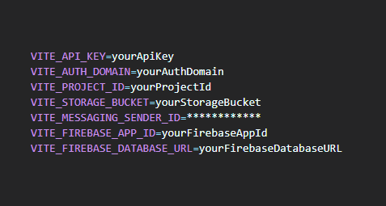

##### 3.1 Explanation of Variables:

* **VITE_API_KEY** : Your Firebase API key.
* **VITE_AUTH_DOMAIN** : The Firebase Authentication domain for your project.
* **VITE_PROJECT_ID** : The project ID in Firebase.
* **VITE_STORAGE_BUCKET** : The address of Firebase Storage for your project.
* **VITE_MESSAGING_SENDER_ID** : Sender ID for Firebase Cloud Messaging.
* **VITE_FIREBASE_APP_ID** : The app ID in Firebase.
* **VITE_FIREBASE_DATABASE_URL** : The URL of Firebase Realtime Database.

##### 3.2 Environment Variables Sample (.env_sample)

The `.env_sample` file serves as a template for the `.env` configuration file. This file should be shared with the team so they know which environment variables are needed without exposing actual values.

Example content of a `.env_sample` file:

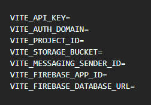

**Instructions:**

* Each variable should be filled with the corresponding value from the Firebase console or other project configuration.
* Ensure this file does not contain actual sensitive data, only the names of the variables.

##### 3.3 Firebase Configuration (firebase-config.js)

The `firebase-config.js` file initializes Firebase services in your application using data from the `.env` file. This file contains the logic to connect with Firebase Authentication, Realtime Database, and Storage.

Example content of the `firebase-config.js` file:

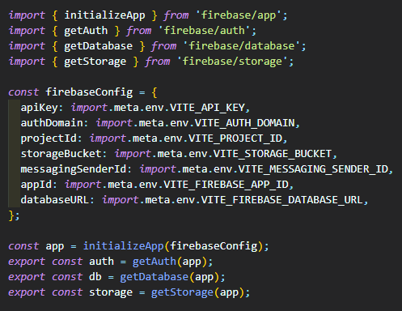

**Explanation:**

* **initializeApp(firebaseConfig)** : Initializes Firebase with the configuration data from the `.env` file.
* **getAuth(app)** : Enables the use of Firebase Authentication in your application.
* **getDatabase(app)** : Provides access to Firebase Realtime Database.
* **getStorage(app)** : Provides access to Firebase Storage.

This file should be included in your project to effectively and securely use Firebase services.

### 4. Entity-Relationship Diagram (ERD)

An Entity-Relationship Diagram (ERD) is a visual representation of the data and their relationships within a system.

##### 4.1 **User**

* **Attributes:**
  * `user_id` (Primary Key)
  * `email`
  * `password`
  * `name`
  * `profile_picture`
  * `role` (e.g., Admin, Organizer, User)
  * `created_at`
  * `updated_at`

##### **4.2 Quiz**

* **Attributes:**
  * `quiz_id` (Primary Key)
  * `title`
  * `description`
  * `category`
  * `created_by` (Foreign Key referencing `User`)
  * `created_at`
  * `updated_at`

##### **4.3 Question**

* **Attributes:**
  * `question_id` (Primary Key)
  * `quiz_id` (Foreign Key referencing `Quiz`)
  * `question_text`
  * `question_type` (e.g., Multiple Choice, True/False)
  * `created_at`
  * `updated_at`

##### **4.4 Answer**

* **Attributes:**
  * `answer_id` (Primary Key)
  * `question_id` (Foreign Key referencing `Question`)
  * `answer_text`
  * `is_correct` (Boolean)
  * `created_at`
  * `updated_at`

##### **4.5 QuizAttempt**

* **Attributes:**
  * `attempt_id` (Primary Key)
  * `user_id` (Foreign Key referencing `User`)
  * `quiz_id` (Foreign Key referencing `Quiz`)
  * `score`
  * `attempt_date`

##### **4.6 QuizBattle**

* **Attributes:**
  * `battle_id` (Primary Key)
  * `quiz_id` (Foreign Key referencing `Quiz`)
  * `creator_id` (Foreign Key referencing `User`)
  * `status` (e.g., Pending, Active, Completed)
  * `created_at`

##### **4.7 BattleParticipant**

* **Attributes:**
  * `participant_id` (Primary Key)
  * `battle_id` (Foreign Key referencing `QuizBattle`)
  * `user_id` (Foreign Key referencing `User`)
  * `score`
  * `joined_at`

##### **4.8 Category**

* **Attributes:**
  * `category_id` (Primary Key)
  * `category_name`
  * `description`

##### **4.8 Tournament**

* **Attributes:**
  * `tournament_id` (Primary Key)
  * `title`
  * `description`
  * `start_date`
  * `end_date`
  * `created_by` (Foreign Key referencing `User`)

##### **4.9 TournamentParticipant**

* **Attributes:**
  * `tournament_participant_id` (Primary Key)
  * `tournament_id` (Foreign Key referencing `Tournament`)
  * `user_id` (Foreign Key referencing `User`)
  * `score`

### 5. Relationships

1. **User - Quiz**
   * One-to-Many: A user can create multiple quizzes. A quiz is created by one user.
2. **Quiz - Question**
   * One-to-Many: A quiz can contain multiple questions. Each question belongs to one quiz.
3. **Question - Answer**
   * One-to-Many: A question can have multiple answers. Each answer is associated with one question.
4. **User - QuizAttempt**
   * One-to-Many: A user can attempt multiple quizzes. Each quiz attempt is associated with one user.
5. **Quiz - QuizAttempt**
   * One-to-Many: A quiz can be attempted multiple times by users. Each quiz attempt is associated with one quiz.
6. **QuizBattle - User**
   * Many-to-Many: A quiz battle can have multiple participants, and a user can participate in multiple battles. This is managed through the `BattleParticipant` entity.
7. **QuizBattle - Quiz**
   * Many-to-One: A quiz battle is based on one quiz. A quiz can have multiple battles.
8. **Tournament - User**
   * Many-to-Many: A tournament can have multiple participants, and a user can participate in multiple tournaments. This is managed through the `TournamentParticipant` entity.
9. **QuizBattle - Tournament**
   * Optional: A quiz battle may be part of a tournament.
10. **Category - Quiz**
    * One-to-Many: A category can have multiple quizzes. Each quiz belongs to one category.

### 6. Project Structure

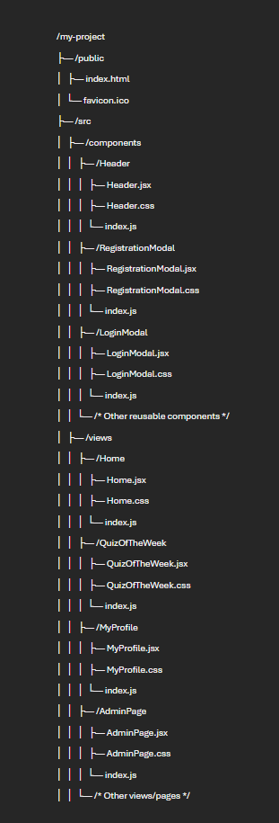 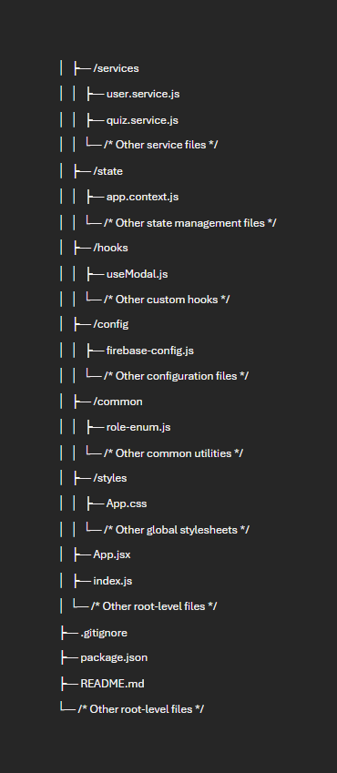

##### 6.1 Explanation of Each Directory and Key Files

###### `/public`

* **`index.html`** : The main HTML file where your React app is mounted.
* **`favicon.ico`** : The favicon for your application.

###### `/src`

* **`/components`** : Contains reusable UI components.
* **`/Header`** : Example of a component folder with `Header.jsx` for the component logic, `Header.css` for styles, and `index.js` for exporting the component.
* **`/RegistrationModal`** : Modal component
* **`/LoginModal`** : Login modal component
* **`/* Other reusable components`** : Additional reusable components for UI elements like buttons, forms, etc.
* **`/views`** : Contains page-level components or views representing different routes or sections of the application.
* **`/Home`** : Component for the home page.
* **`/QuizOfTheWeek`** : Component for the "Quiz of the Week" page.
* **`/MyProfile`** : Component for the user profile page.
* **`/AdminPage`** : Component for the admin dashboard or page.
* **`/* Other views/pages`** : Other views like quiz categories, rankings, etc.
* **`/services`** : Contains functions for interacting with Firebase or other APIs.
* **`user.service.js`** : Functions for user-related operations (e.g., fetching user data).
* **`quiz.service.js`** : Functions for quiz-related operations (e.g., creating and fetching quizzes).
* **`/* Other service files`** : Additional service files for other functionalities.
* **`/state`** : Contains files related to state management.
* **`app.context.js`** : Context provider for global state management using React Context API.
* **`/* Other state management files`** : Additional files for state management if needed.
* **`/hooks`** : Contains custom React hooks for reusable logic.
* **`useModal.js`** : Custom hook for managing modal state.
* **`/* Other custom hooks`** : Additional hooks for other reusable logic.
* **`/config`** : Contains configuration files.
* **`firebase-config.js`** : Firebase initialization and configuration.
* **`/* Other configuration files`** : Additional configuration files if needed.
* **`/common`** : Contains common utilities and enums.
* **`role-enum.js`** : Enum for user roles.
* **`/* Other common utilities`** : Other utility files used across the application.
* **`/styles`** : Contains global stylesheets.
* **`App.css`** : Global CSS styles for the application.
* **`/* Other global stylesheets`** : Additional global CSS files if needed.
* **`App.jsx`** : The root component that sets up routing and the main layout.
* **`index.js`** : Entry point for the React application; renders the `App` component and attaches it to the DOM.

##### 6.2 Root-Level Files

* **`.gitignore`** : Specifies files and directories to ignore in version control.
* **`package.json`** : Contains project metadata, dependencies, and scripts.
* **`README.md`** : Documentation file for the project, providing an overview and instructions.
